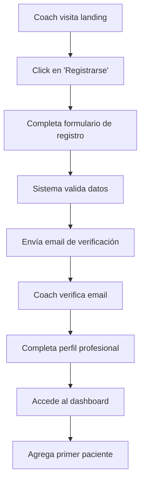
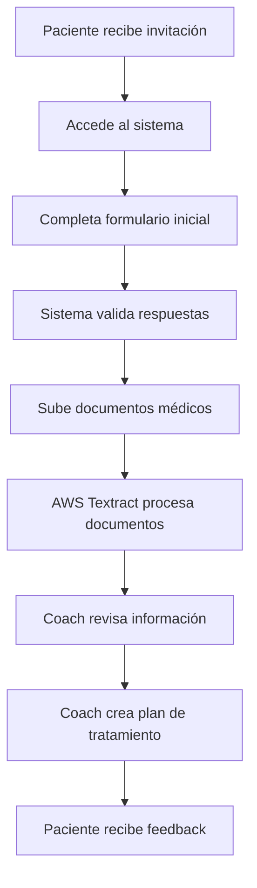
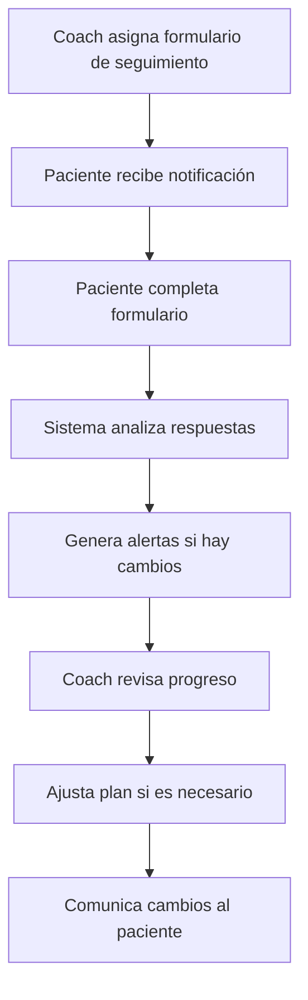

# Documento de Requisitos del Producto (PRD)
## NELHEALTHCOACH - Plataforma Integral de Coaching de Salud

**Versión:** 1.0.0  
**Fecha:** 4 de abril de 2026  
**Autor:** Equipo de Desarrollo NELHEALTHCOACH  
**Estado:** En desarrollo activo

---

## Tabla de Contenidos

1. [Resumen Ejecutivo](#1-resumen-ejecutivo)
2. [Objetivos del Producto](#2-objetivos-del-producto)
3. [Público Objetivo](#3-público-objetivo)
4. [Arquitectura del Sistema](#4-arquitectura-del-sistema)
5. [Requisitos Funcionales](#5-requisitos-funcionales)
6. [Requisitos No Funcionales](#6-requisitos-no-funcionales)
7. [Flujos de Usuario](#7-flujos-de-usuario)
8. [Stack Tecnológico](#8-stack-tecnológico)
9. [Roadmap de Desarrollo](#9-roadmap-de-desarrollo)
10. [Métricas de Éxito](#10-métricas-de-éxito)
11. [Consideraciones de Seguridad](#11-consideraciones-de-seguridad)
12. [Consideraciones de Privacidad](#12-consideraciones-de-privacidad)
13. [Apéndices](#13-apéndices)

---

## 1. Resumen Ejecutivo

### 1.1 Visión del Producto
NELHEALTHCOACH es una plataforma integral de coaching de salud diseñada para conectar profesionales de la salud con pacientes, facilitando la gestión de tratamientos, seguimiento de progreso y comunicación efectiva en un entorno digital seguro y moderno.

### 1.2 Propuesta de Valor
- **Para Coaches de Salud:** Herramientas profesionales para gestionar pacientes, analizar datos de salud y optimizar tratamientos.
- **Para Pacientes:** Experiencia de usuario intuitiva para completar formularios de salud, subir documentos y seguir su progreso.
- **Para la Industria:** Plataforma escalable que cumple con estándares de privacidad médica y facilita la digitalización de procesos de salud.

### 1.3 Diferenciadores Clave
1. **Arquitectura Monorepo:** Desarrollo unificado con aplicaciones independientes pero integradas.
2. **Procesamiento Inteligente:** Uso de AWS Textract para extracción automática de datos de documentos médicos.
3. **Seguridad de Nivel Médico:** Cifrado de datos sensibles y cumplimiento con estándares de privacidad.
4. **Experiencia Omnicanal:** Aplicaciones específicas para diferentes roles y necesidades.

---

## 2. Objetivos del Producto

### 2.1 Objetivos Principales (OKRs)

#### **Objetivo 1: Crear una plataforma integral de coaching de salud**
- **KR1:** Desarrollar 4 aplicaciones integradas (Landing, Formularios, Dashboard, API)
- **KR2:** Implementar al menos 10 formularios de evaluación de salud
- **KR3:** Lograr 99.5% de disponibilidad del sistema

#### **Objetivo 2: Garantizar seguridad y privacidad de datos médicos**
- **KR1:** Implementar cifrado de extremo a extremo para datos sensibles
- **KR2:** Cumplir con HIPAA/GDPR para manejo de datos de salud
- **KR3:** Realizar auditorías de seguridad trimestrales

#### **Objetivo 3: Optimizar experiencia de usuario**
- **KR1:** Reducir tiempo de completado de formularios en 40%
- **KR2:** Lograr puntuación NPS > 70
- **KR3:** Mantener tiempo de carga de página < 2 segundos

---

## 3. Público Objetivo

### 3.1 Personas Principales

#### **Coaches de Salud (Usuario Primario)**
- **Demografía:** Profesionales de salud certificados, 30-60 años
- **Necesidades:**
  - Gestión eficiente de múltiples pacientes
  - Acceso rápido a historiales médicos
  - Herramientas de análisis de datos de salud
  - Comunicación segura con pacientes
- **Frustraciones:**
  - Sistemas fragmentados de gestión
  - Procesos manuales de documentación
  - Preocupaciones sobre seguridad de datos

#### **Pacientes (Usuario Secundario)**
- **Demografía:** Adultos buscando coaching de salud, 25-70 años
- **Necesidades:**
  - Fácil acceso a formularios de salud
  - Seguimiento claro de su progreso
  - Comunicación directa con su coach
  - Privacidad de sus datos médicos
- **Frustraciones:**
  - Formularios médicos complejos
  - Falta de seguimiento post-consulta
  - Preocupaciones sobre privacidad digital

### 3.2 Mercado Objetivo
- **Segmento:** Coaching de salud preventivo y gestión de condiciones crónicas
- **Tamaño de Mercado:** $7 billones globalmente (salud digital)
- **Crecimiento:** 25% CAGR en salud digital
- **Competencia:** Plataformas como BetterHelp, Noom, pero especializadas en coaching

---

## 4. Arquitectura del Sistema

### 4.1 Diagrama de Arquitectura

```
┌─────────────────────────────────────────────────────────────┐
│                    NELHEALTHCOACH PLATFORM                  │
├─────────────────────────────────────────────────────────────┤
│                                                             │
│  ┌─────────────┐  ┌─────────────┐  ┌─────────────┐        │
│  │   Landing   │  │   Formularios│  │  Dashboard  │        │
│  │   (Next.js) │  │   (Next.js) │  │   (Next.js) │        │
│  └──────┬──────┘  └──────┬──────┘  └──────┬──────┘        │
│         │                │                 │               │
│         └────────────────┼─────────────────┘               │
│                          │                                 │
│                 ┌────────▼────────┐                       │
│                 │    API Backend   │                       │
│                 │    (Next.js)     │                       │
│                 └────────┬─────────┘                       │
│                          │                                 │
├──────────────────────────┼─────────────────────────────────┤
│         Cloud Services   │                                 │
│  ┌─────────┐ ┌─────────┐│ ┌─────────┐ ┌─────────┐         │
│  │ MongoDB │ │ AWS S3  ││ │AWS Text-│ │ Resend  │         │
│  │ Atlas   │ │         ││ │  tract  │ │  Email  │         │
│  └─────────┘ └─────────┘│ └─────────┘ └─────────┘         │
│                         │                                 │
└─────────────────────────┼─────────────────────────────────┘
                          │
                  ┌───────▼───────┐
                  │   Vercel      │
                  │   Hosting     │
                  └───────────────┘
```

### 4.2 Componentes del Sistema

#### **4.2.1 Aplicación Landing (`apps/landing`)**
- **Propósito:** Marketing y captación de leads
- **Tecnologías:** Next.js 15, React 19, Tailwind CSS
- **Características:**
  - Diseño responsive y optimizado para conversión
  - Información sobre servicios de coaching
  - Formulario de contacto y captación
  - SEO optimizado para términos de salud

#### **4.2.2 Aplicación de Formularios (`apps/form`)**
- **Propósito:** Captura de datos de pacientes
- **Tecnologías:** Next.js, React Hook Form, Yup
- **Características:**
  - Formularios validados en tiempo real
  - Subida de documentos médicos
  - Experiencia de usuario optimizada para móvil
  - Guardado automático de progreso

#### **4.2.3 Dashboard de Coaching (`apps/dashboard`)**
- **Propósito:** Gestión y análisis para coaches
- **Tecnologías:** Next.js, MongoDB, AWS S3
- **Características:**
  - Visualización de pacientes y progreso
  - Análisis estadísticos de datos de salud
  - Gestión de documentos y comunicaciones
  - Panel administrativo con permisos

#### **4.2.4 API Backend (`apps/api`)**
- **Propósito:** Lógica de negocio y servicios
- **Tecnologías:** Next.js API Routes, MongoDB, AWS SDK
- **Características:**
  - Autenticación JWT
  - CRUD completo de pacientes y usuarios
  - Procesamiento de documentos con AWS Textract
  - Integración con servicios de email

### 4.3 Base de Datos

#### **Esquema Principal**
```javascript
// Usuarios (Coaches y Administradores)
User {
  _id: ObjectId
  email: String (único)
  passwordHash: String
  role: ['coach', 'admin']
  profile: {
    name: String
    specialization: String
    licenseNumber: String
    phone: String
  }
  createdAt: Date
  updatedAt: Date
}

// Pacientes
Patient {
  _id: ObjectId
  coachId: ObjectId (ref: User)
  personalInfo: {
    name: String
    email: String
    phone: String
    dateOfBirth: Date
    gender: String
  }
  medicalHistory: {
    conditions: [String]
    medications: [String]
    allergies: [String]
    surgeries: [String]
  }
  assessments: [{
    formId: String
    completedAt: Date
    data: Object
    score: Number
  }]
  documents: [{
    name: String
    s3Key: String
    uploadedAt: Date
    processedData: Object // Extraído por Textract
  }]
  createdAt: Date
  updatedAt: Date
}

// Formularios de Evaluación
AssessmentForm {
  _id: ObjectId
  name: String
  description: String
  category: ['initial', 'followup', 'specialized']
  questions: [{
    id: String
    type: ['text', 'number', 'select', 'checkbox', 'scale']
    question: String
    options: [String]
    validation: Object
  }]
  scoringLogic: Object
  createdAt: Date
  updatedAt: Date
}
```

---

## 5. Requisitos Funcionales

### 5.1 Gestión de Usuarios

#### **RF-001: Registro y Autenticación**
- **ID:** RF-001
- **Prioridad:** Alta
- **Descripción:** Los coaches deben poder registrarse y autenticarse en el sistema
- **Criterios de Aceptación:**
  1. Formulario de registro con email, contraseña y datos profesionales
  2. Verificación de email mediante enlace único
  3. Login seguro con JWT tokens
  4. Recuperación de contraseña
  5. Sesiones persistentes con refresh tokens

#### **RF-002: Gestión de Perfiles**
- **ID:** RF-002
- **Prioridad:** Media
- **Descripción:** Usuarios pueden gestionar su perfil profesional
- **Criterios de Aceptación:**
  1. Edición de información personal y profesional
  2. Subida de credenciales/certificaciones
  3. Configuración de preferencias de notificación
  4. Cambio de contraseña seguro

### 5.2 Gestión de Pacientes

#### **RF-003: Creación de Pacientes**
- **ID:** RF-003
- **Prioridad:** Alta
- **Descripción:** Coaches pueden agregar nuevos pacientes al sistema
- **Criterios de Aceptación:**
  1. Formulario con datos personales básicos
  2. Asignación automática de ID único
  3. Invitación por email al paciente
  4. Configuración inicial de permisos

#### **RF-004: Vista de Lista de Pacientes**
- **ID:** RF-004
- **Prioridad:** Alta
- **Descripción:** Coaches pueden ver y buscar en su lista de pacientes
- **Criterios de Aceptación:**
  1. Lista paginada con información básica
  2. Filtros por estado, última actividad, etc.
  3. Búsqueda por nombre, email o ID
  4. Ordenamiento por múltiples criterios

#### **RF-005: Perfil Detallado de Paciente**
- **ID:** RF-005
- **Prioridad:** Alta
- **Descripción:** Vista completa de información del paciente
- **Criterios de Aceptación:**
  1. Pestañas para diferentes tipos de información
  2. Historial médico completo
  3. Progreso en evaluaciones
  4. Documentos subidos
  5. Notas y comentarios del coach

### 5.3 Formularios de Evaluación

#### **RF-006: Completar Formularios de Salud**
- **ID:** RF-006
- **Prioridad:** Crítica
- **Descripción:** Pacientes pueden completar formularios de evaluación
- **Criterios de Aceptación:**
  1. Interfaz responsive y accesible
  2. Validación en tiempo real
  3. Guardado automático del progreso
  4. Retroalimentación inmediata
  5. Posibilidad de pausar y continuar

#### **RF-007: Diseño de Formularios Personalizados**
- **ID:** RF-007
- **Prioridad:** Media
- **Descripción:** Coaches pueden crear formularios personalizados
- **Criterios de Aceptación:**
  1. Editor drag-and-drop de preguntas
  2. Múltiples tipos de preguntas (texto, selección, escala)
  3. Lógica condicional entre preguntas
  4. Configuración de validaciones
  5. Plantillas predefinidas

#### **RF-008: Análisis de Resultados**
- **ID:** RF-008
- **Prioridad:** Alta
- **Descripción:** Sistema analiza y presenta resultados de formularios
- **Criterios de Aceptación:**
  1. Cálculo automático de puntuaciones
  2. Visualizaciones gráficas de progreso
  3. Comparativas con promedios
  4. Alertas para valores preocupantes
  5. Exportación de reportes

### 5.4 Gestión de Documentos

#### **RF-009: Subida de Documentos Médicos**
- **ID:** RF-009
- **Prioridad:** Alta
- **Descripción:** Pacientes pueden subir documentos médicos
- **Criterios de Aceptación:**
  1. Soporte para PDF, JPG, PNG
  2. Límite de tamaño 10MB por archivo
  3. Progreso de upload visible
  4. Categorización de documentos
  5. Vista previa de documentos

#### **RF-010: Procesamiento con AWS Textract**
- **ID:** RF-010
- **Prioridad:** Media
- **Descripción:** Extracción automática de datos de documentos
- **Criterios de Aceptación:**
  1. Detección de texto en documentos escaneados
  2. Extracción de datos estructurados (tablas)
  3. Mapeo a campos del sistema
  4. Revisión y corrección manual
  5. Almacenamiento de metadatos extraídos

#### **RF-011: Organización de Documentos**
- **ID:** RF-011
- **Prioridad:** Baja
- **Descripción:** Sistema organiza documentos por categorías
- **Criterios de Aceptación:**
  1. Categorías predefinidas (laboratorios, recetas, etc.)
  2. Etiquetado manual y automático
  3. Búsqueda por contenido y metadatos
  4. Vista de línea de tiempo de documentos

### 5.5 Comunicación y Notificaciones

#### **RF-012: Sistema de Mensajería Segura**
- **ID:** RF-012
- **Prioridad:** Media
- **Descripción:** Comunicación encriptada entre coaches y pacientes
- **Criterios de Aceptación:**
  1. Chat en tiempo real
  2. Historial de conversaciones
  3. Notificaciones push/email
  4. Archivos adjuntos en mensajes
  5. Cifrado de extremo a extremo

#### **RF-013: Notificaciones Automatizadas**
- **ID:** RF-013
- **Prioridad:** Media
- **Descripción:** Sistema envía notificaciones basadas en eventos
- **Criterios de Aceptación:**
  1. Recordatorios de formularios pendientes
  2. Alertas de resultados anormales
  3. Notificaciones de nuevas mensajes
  4. Personalización de frecuencia
  5. Opción de desactivar notificaciones

### 5.6 Análisis y Reportes

#### **RF-014: Dashboard Analítico**
- **ID:** RF-014
- **Prioridad:** Alta
- **Descripción:** Coaches ven métricas y análisis de su práctica
- **Criterios de Aceptación:**
  1. Métricas clave de pacientes activos
  2. Tendencias de progreso
  3. Comparativas entre pacientes
  4. Alertas proactivas
  5. Filtros por período y categorías

#### **RF-015: Generación de Reportes**
- **ID:** RF-015
- **Prioridad:** Media
- **Descripción:** Sistema genera reportes profesionales
- **Criterios de Aceptación:**
  1. Reportes de progreso individual
  2. Reportes agregados de práctica
  3. Formatos PDF y Excel
  4. Personalización de contenido
  5. Programación de envío automático

---

## 6. Requisitos No Funcionales

### 6.1 Rendimiento

#### **NF-001: Tiempos de Respuesta**
- **ID:** NF-001
- **Categoría:** Rendimiento
- **Descripción:** El sistema debe responder dentro de límites específicos
- **Métricas:**
  - Página de carga inicial: < 2 segundos
  - Búsquedas: < 1 segundo
  - Subida de documentos: < 10 segundos (10MB)
  - API responses: < 500ms (p95)

#### **NF-002: Escalabilidad**
- **ID:** NF-002
- **Categoría:** Escalabilidad
- **Descripción:** Sistema debe escalar para miles de usuarios concurrentes
- **Métricas:**
  - Soporte para 10,000 usuarios activos
  - 100 coaches simultáneos
  - 1,000 formularios completados por hora
  - Escalado automático basado en carga

### 6.2 Seguridad

#### **NF-003: Autenticación y Autorización**
- **ID:** NF-003
- **Categoría:** Seguridad
- **Descripción:** Sistema debe implementar controles de acceso robustos
- **Requisitos:**
  - Autenticación multi-factor opcional
  - Tokens JWT con expiración corta
  - Refresh tokens rotativos
  - Control de acceso basado en roles (RBAC)
  - Registro de auditoría de accesos

#### **NF-004: Protección de Datos**
- **ID:** NF-004
- **Categoría:** Seguridad
- **Descripción:** Datos médicos deben estar protegidos
- **Requisitos:**
  - Cifrado en tránsito (TLS 1.3+)
  - Cifrado en reposo (AES-256)
  - Datos sensibles cifrados a nivel de campo
  - Backup encriptados
  - Políticas de retención y destrucción

### 6.3 Disponibilidad y Confiabilidad

#### **NF-005: Disponibilidad**
- **ID:** NF-005
- **Categoría:** Confiabilidad
- **Descripción:** Sistema debe estar disponible cuando sea necesario
- **Métricas:**
  - Disponibilidad general: 99.5%
  - Tiempo de recuperación (RTO): < 1 hora
  - Punto de recuperación (RPO): < 15 minutos
  - Monitoreo 24/7 con alertas

#### **NF-006: Tolerancia a Fallos**
- **ID:** NF-006
- **Categoría:** Confiabilidad
- **Descripción:** Sistema debe manejar fallos de componentes
- **Requisitos:**
  - Replicación de base de datos
  - Balanceo de carga entre instancias
  - Failover automático
  - Recuperación de datos corruptos

### 6.4 Usabilidad

#### **NF-007: Experiencia de Usuario**
- **ID:** NF-007
- **Categoría:** Usabilidad
- **Descripción:** Interfaz debe ser intuitiva y accesible
- **Requisitos:**
  - Cumplimiento WCAG 2.1 AA
  - Diseño responsive (mobile-first)
  - Tiempo de aprendizaje < 30 minutos
  - Satisfacción de usuario (CSAT > 85%)

#### **NF-008: Internacionalización**
- **ID:** NF-008
- **Categoría:** Usabilidad
- **Descripción:** Sistema debe soportar múltiples idiomas
- **Requisitos:**
  - Soporte para español e inglés inicialmente
  - Fácil adición de nuevos idiomas
  - Formato de fechas y números localizado
  - RTL support para idiomas árabes

### 6.5 Mantenibilidad

#### **NF-009: Código y Documentación**
- **ID:** NF-009
- **Categoría:** Mantenibilidad
- **Descripción:** Código debe ser mantenible y documentado
- **Requisitos:**
  - Cobertura de tests > 80%
  - Documentación de API completa
  - Guías de desarrollo y despliegue
  - Monitoreo de deuda técnica

#### **NF-010: Despliegue y Operaciones**
- **ID:** NF-010
- **Categoría:** Mantenibilidad
- **Descripción:** Sistema debe ser fácil de desplegar y operar
- **Requisitos:**
  - Despliegue automatizado (CI/CD)
  - Rollback automático en fallos
  - Monitoreo de métricas de negocio
  - Alertas proactivas de problemas

---

## 7. Flujos de Usuario

### 7.1 Flujo de Registro de Coach



### 7.2 Flujo de Evaluación de Paciente



### 7.3 Flujo de Seguimiento Continuo



---

## 8. Stack Tecnológico

### 8.1 Frontend
- **Framework:** Next.js 15.5.4 con App Router
- **UI Library:** React 19.1.0
- **Estilos:** Tailwind CSS 4.0 + PostCSS
- **Formularios:** React Hook Form + Yup
- **Gráficos:** Recharts o Chart.js
- **Estado:** React Context + Zustand (si necesario)

### 8.2 Backend
- **Runtime:** Node.js 18+
- **Framework:** Next.js API Routes
- **Base de Datos:** MongoDB 6.0 + Mongoose 8.0
- **Autenticación:** JWT + bcrypt
- **Email:** Resend + AWS SES
- **Archivos:** AWS S3 + Multer

### 8.3 Infraestructura
- **Hosting:** Vercel (frontend) + AWS (backend services)
- **CI/CD:** GitHub Actions
- **Monitoreo:** Sentry + Datadog
- **Logs:** AWS CloudWatch
- **Cache:** Redis (si necesario)

### 8.4 Desarrollo
- **Lenguaje:** TypeScript 5.8
- **Package Manager:** npm 9+
- **Build System:** Turbo (monorepo)
- **Linting:** ESLint + Prettier
- **Testing:** Jest + React Testing Library + Cypress

---

## 9. Roadmap de Desarrollo

### Fase 1: MVP (Mes 1-3)
- **Sprint 1:** Arquitectura base y autenticación
- **Sprint 2:** Gestión básica de pacientes
- **Sprint 3:** Formularios de evaluación inicial
- **Sprint 4:** Dashboard básico y landing page

### Fase 2: Características Principales (Mes 4-6)
- **Sprint 5:** Subida y procesamiento de documentos
- **Sprint 6:** Sistema de mensajería segura
- **Sprint 7:** Análisis avanzado y reportes
- **Sprint 8:** Internacionalización y accesibilidad

### Fase 3: Escalabilidad y Optimización (Mes 7-9)
- **Sprint 9:** Performance y optimización
- **Sprint 10:** Escalabilidad y alta disponibilidad
- **Sprint 11:** Integraciones con sistemas de salud
- **Sprint 12:** Preparación para lanzamiento público

### Fase 4: Crecimiento y Expansión (Mes 10-12)
- **Sprint 13:** Mobile app nativa
- **Sprint 14:** Machine learning para predicciones
- **Sprint 15:** Marketplace de coaches
- **Sprint 16:** Expansión internacional

---

## 10. Métricas de Éxito

### 10.1 Métricas de Producto
- **Adopción:** 100 coaches activos en 6 meses
- **Retención:** 80% de coaches retenidos después de 3 meses
- **Engagement:** 5 formularios completados por paciente/mes
- **Satisfacción:** NPS > 70, CSAT > 85%

### 10.2 Métricas Técnicas
- **Performance:** Page Load Time < 2s, TTFB < 500ms
- **Disponibilidad:** 99.5% uptime
- **Errores:** Error rate < 0.1%
- **Seguridad:** 0 brechas de datos

### 10.3 Métricas de Negocio
- **Crecimiento:** 20% MoM growth en usuarios
- **Ingresos:** $50k MRR en 12 meses
- **Costo:** CAC < $100 por coach
- **LTV:** LTV > 3x CAC

---

## 11. Consideraciones de Seguridad

### 11.1 Cumplimiento Normativo
- **HIPAA:** Para datos de salud en EE.UU.
- **GDPR:** Para usuarios en la Unión Europea
- **LGPD:** Para usuarios en Brasil
- **PIPEDA:** Para usuarios en Canadá

### 11.2 Controles de Seguridad
- **Autenticación:** MFA, contraseñas fuertes, lockout después de intentos
- **Autorización:** RBAC con mínimo privilegio necesario
- **Cifrado:** TLS 1.3, AES-256 para datos en reposo
- **Auditoría:** Logs completos de todas las operaciones
- **Backup:** Backup encriptados diarios, retención de 7 años

### 11.3 Respuesta a Incidentes
- **Detección:** Monitoreo 24/7, alertas automáticas
- **Contención:** Plan de respuesta documentado
- **Erradicación:** Procedimientos para eliminar amenazas
- **Recuperación:** Plan de recuperación de desastres
- **Lecciones:** Análisis post-incidente y mejora

---

## 12. Consideraciones de Privacidad

### 12.1 Principios de Privacidad
- **Minimización:** Solo datos necesarios para el servicio
- **Transparencia:** Política de privacidad clara
- **Control:** Usuarios controlan sus datos
- **Seguridad:** Protección adecuada de datos
- **Acceso:** Usuarios pueden acceder y corregir sus datos

### 12.2 Manejo de Datos Sensibles
- **Consentimiento:** Consentimiento explícito para datos de salud
- **Anonimización:** Datos anonimizados para análisis agregados
- **Retención:** Política clara de retención y destrucción
- **Transferencia:** Transferencias internacionales seguras

### 12.3 Derechos de los Usuarios
- **Acceso:** Derecho a acceder a sus datos
- **Rectificación:** Derecho a corregir datos incorrectos
- **Eliminación:** Derecho al olvido (con excepciones médicas)
- **Portabilidad:** Derecho a transferir datos
- **Oposición:** Derecho a oponerse al procesamiento

---

## 13. Apéndices

### 13.1 Glosario de Términos
- **Coach de Salud:** Profesional certificado que provee coaching de salud
- **Paciente:** Individuo que recibe servicios de coaching
- **Formulario de Evaluación:** Cuestionario estructurado para evaluar salud
- **AWS Textract:** Servicio de AWS para extracción de texto de documentos
- **JWT:** JSON Web Token para autenticación

### 13.2 Referencias
- [Documentación de Next.js](https://nextjs.org/docs)
- [Guías de HIPAA Compliance](https://www.hhs.gov/hipaa)
- [AWS Well-Architected Framework](https://aws.amazon.com/architecture/well-architected)
- [WCAG 2.1 Guidelines](https://www.w3.org/TR/WCAG21)

### 13.3 Historial de Revisiones

| Versión | Fecha       | Autor               | Cambios Principales           |
|---------|-------------|---------------------|-------------------------------|
| 1.0.0   | 2026-04-04  | Equipo Desarrollo   | Documento inicial completo    |
| 0.9.0   | 2026-03-28  | Product Manager     | Revisión de requisitos        |
| 0.8.0   | 2026-03-21  | Tech Lead           | Especificaciones técnicas     |

---

## Aprobaciones

| Rol               | Nombre               | Firma               | Fecha       |
|-------------------|----------------------|---------------------|-------------|
| Product Owner     |                      |                     |             |
| Tech Lead         |                      |                     |             |
| UX Lead           |                      |                     |             |
| Security Officer  |                      |                     |             |

---

**Documento clasificado como: CONFIDENCIAL**  
© 2026 NELHEALTHCOACH. Todos los derechos reservados.